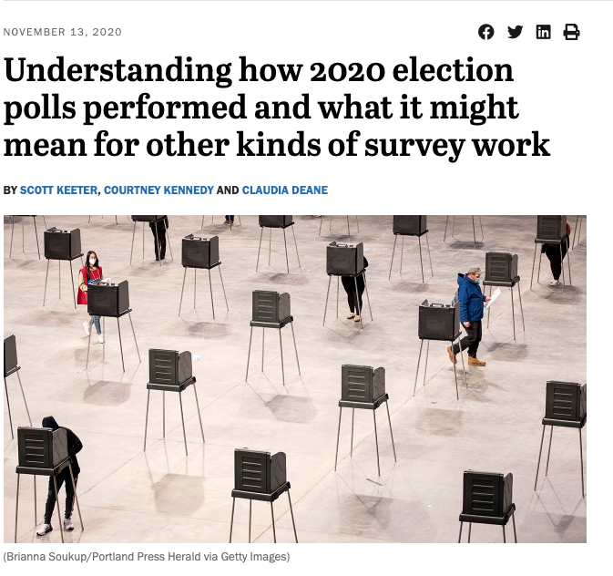

```{r setup, include=FALSE}
knitr::opts_chunk$set(echo = TRUE)
library(tidyverse)
library(plyr)
library(latex2exp)
```

## Agenda
  
- Housekeeping
- Back to Basics with R
- Hypothesis Testing 
- Fixed Effects
- Missing Data

## Housekeeping

- Take a deep breath - you're through the midterm 
- Only 30% of the class is completed thus far (20% midterm, 10% Problem Set)
  - Even if you didn't do the best, lots of the course left 
- Questions?

## Housekeeping Con't

- Reminder of deadlines
  - April 5th $\rightarrow$ one-page memo 
  - April 12th $\rightarrow$ first draft of poster 
  - April 18th $\rightarrow$ final draft of poster
  - April 23rd $\rightarrow$ poster session 
  
## Back to Basics with R

Setting working directory 

- You must tell R where you want it to find files 
- You can do this with setwd() 
- If you are saving things to your Downloads, then you must tell R to look there
- Live Example 

## Back to Basics with R

Installing and loading packages

- If you want to use tidyverse, you must load tidyverse 
- If you have loaded it, but closed R, you must load it again 

## Back to Basics with R

Don't use RMarkdown as a script

- RMarkdown is great for compiling a PDF
- It is, however, not meant for you to click the run button manually 
- Main problem? Reproducibility ESPECIALLY if you overwrite your dataframes
- Live Example

## Questions

- Questions?


## Hyphothesis Testing

- We've covered hypothesis testing for $\widehat \beta$
  - Taking a step back - it was simply a comparison of distributions with \textbf{means}
- We can apply hypothesis testing to compare means of quantities 
  - Recall that the `lm` function uses the t-distribution instead of the normal

1. Specify a null and an alternative hypothesis
2. Use the null hypothesis to specify a null distribution 
3. See how likely our alternative hypothesis is given the null distribution

## Hypothesis Testing Example

- The MLB lowered the height of the pitching mound by five inches after the 1968 season
  - Pitchers were getting too good! 
- Was the average number of homeruns per player different in 1968 to 1969? 

```{r}
data(baseball)
baseball <- baseball[baseball$year >= 1968 & 
                       baseball$year <= 1969,]
```

## Hypothesis Testing Example 2

```{r}
hr <- t.test(baseball$hr[baseball$year == 1968],
             baseball$hr[baseball$year == 1969],
             na.action = na.omit)

hr
```

## Hypothesis Testing Example 3

How do we do this by hand? 

```{r}
est <- mean(baseball$hr[baseball$year == 1968]) -
  mean(baseball$hr[baseball$year == 1969])
treatSE <- var(baseball$hr[baseball$year == 1969])/
  length(baseball$hr[baseball$year == 1969])
controlSE <- var(baseball$hr[baseball$year == 1968])/
  length(baseball$hr[baseball$year == 1968])
se <- sqrt(treatSE + controlSE)

c(est - (se * 1.96), est + (se * 1.96))
```

## Hypothesis Testing

Questions? 

## Fixed Effects

- Your data may have observations that are just simply somewhat different from each other 
- Example: do Presidents allocate federal funds to districts that supported them in the previous election? 
  - California has different needs from Arkansas 
- How do we control for this in our regressions? 
  - \pause Fixed effects! 
- Fixed effects are simply indicators for a particular trait of an observation or multiple observations
- If we simply ran a regression, the California observation would dominate our calculation of $\widehat \beta$

## Fixed Effect Implementation 

- Packages such as `fixest`, but can manually do it through base R
- Sometimes the fixed effect we want to control for is a year 
  - Years are numeric, so to turn them into indicators we use `factor`
  - Generally good practice to ``factorize'' our fixed effects

```{r, eval=F}
model1 <- lm(y ~ x1 + x2, data = df)
model2 <- lm(y ~ x1 + x2 + factor(state), data = df)
```

## Fixed Effect Live Coding

https://tinyurl.com/gov51dataframe


## Missing Data Background

- Throughout modern social science, researchers have oftentimes dropped missing data 

```{r, eval=FALSE}
mean(data$variable, na.rm = TRUE)
```

- However, simply dropping missing data can induce bias, given missingness is not always random 

## Example of Non-Random Missingness

\centering
```{r, echo=FALSE, out.height = "5cm"}

```

What if poll response is not representative? 

## Framework for Understanding Missing Data

- Problem: Our data is incomplete
- Solution: Depends on our assumptions about the missing data
- Each assumption is generally mutually exclusive and affects our strategies to address them 

## Assumptions 

1. Missing Completely at Random (MCAR)
2. Missing at Random (MAR)
3. Missing Not at Random (MNAR)

## Missing Completely at Random (MCAR)

- Observations are missing at random
- Listwise deletion (e.g. dropping the observations with missing data) does not induce bias 
- Incredibly stringent assumption - not many real world situations have data that is missing completely at random 

\begin{table}[]
\begin{tabular}{lllll}
\hline
\multicolumn{1}{|l|}{i} & \multicolumn{1}{l|}{Gender} & \multicolumn{1}{l|}{White} & \multicolumn{1}{l|}{Democrat} & \multicolumn{1}{l|}{Vote Choice} \\ \hline
1 & 1  & 1 & 1  & Trump \\
2 & NA & 1 & 0  & Biden \\
3 & 0  & 0 & 1  & Biden \\
4 & 1  & 0 & NA & Trump \\
5 & NA & 0 & 1  & Trump \\
6 & 0  & 0 & 1  & Biden
\end{tabular}
\end{table}

## Missing Completely at Random (MCAR)

- Observations are missing at random
- Listwise deletion (e.g. dropping the observations with missing data) does not induce bias because data is missing at random 

\begin{table}[]
\begin{tabular}{lllll}
\hline
\multicolumn{1}{|l|}{i} & \multicolumn{1}{l|}{Gender} & \multicolumn{1}{l|}{White} & \multicolumn{1}{l|}{Democrat} & \multicolumn{1}{l|}{Vote Choice} \\ \hline
1 & 1 & 1 & 1 & Trump \\
3 & 0 & 0 & 1 & Biden \\
6 & 0 & 0 & 1 & Biden
\end{tabular}
\end{table}

## Missing at Random (MAR)

- Conditional on observable covariates, observations are missing at random 
  - A bit of a misnomer - probably better to call it conditionally missing at random 
- Less restrictive than MCAR, but still stringent assumption 
- \pause Listwise deletion does induce bias because data is not missing randomly 
  - Example: Worry with polling in 2016 and 2020 is that conservatives are not being captured - listwise deletion would underrepresent this population, making accurate predictions difficult 
- \pause Multiple imputation as a solution 
  - Implementation requires using observed data to \textbf{impute} values that are missing 

## Missing Not at Random (MNAR)

- Unobserved covariates are influencing missingness 
- Least restrictive assumption, but difficult to address given unobserved nature of the bias 
- Listwise deletion would induce bias because data is not missing randomly
- Multiple imputation relies on observed covariates - cannot impute with unobserved covariates 

## Framework for Missing Data

- Missing data has been insufficiently addressed throughout empirical social science 
- In order to address how missing data affects our results, we organize types of missing data

1. MCAR $\rightarrow$ listwise deletion
2. MAR $\rightarrow$ multiple imputation 
3. MNAR $\rightarrow$ better modelling/data collection 

- Gov department features leaders in research on missing data
  - Professor Naijia Liu 
  - Professor Matthew Blackwell 
  - Professor Kosuke Imai 