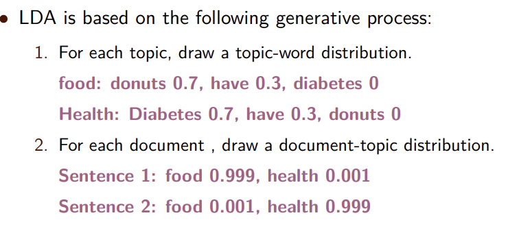
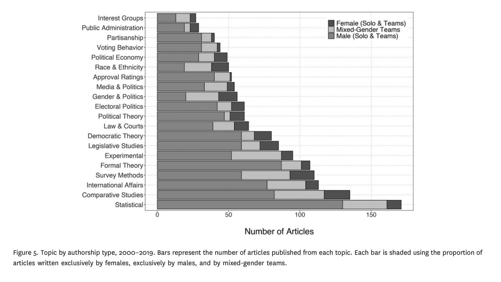
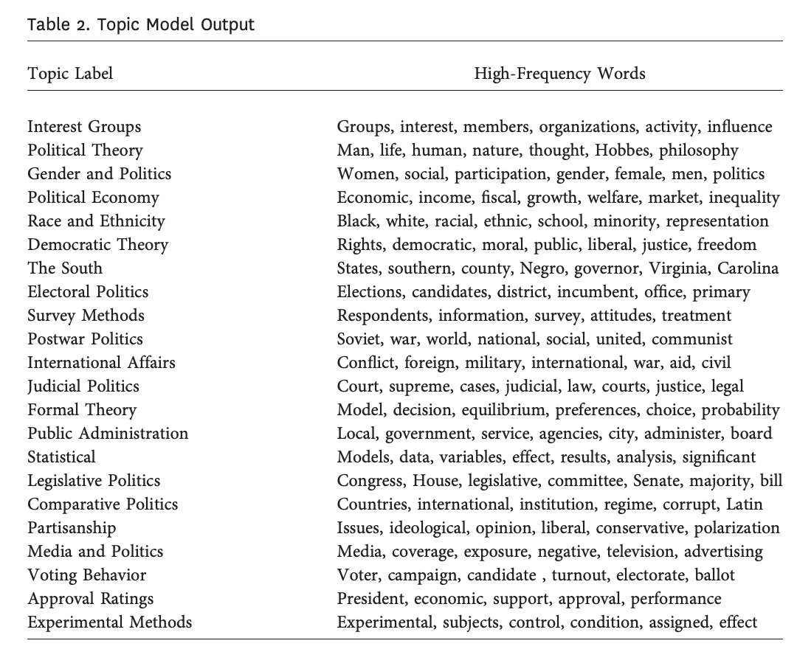

```{r setup, include=FALSE}
knitr::opts_chunk$set(echo = TRUE)
library(tidyverse)
library(topicmodels)
library(tidytext)
data("AssociatedPress")
```

## Agenda

- Housekeeping
- Unsupervised Learning Overview
- Implementation

## Housekeeping

-   Reminder of deadlines
  - April 12th $\rightarrow$ first draft of poster 
  - April 18th $\rightarrow$ final draft of poster
  - April 23rd $\rightarrow$ poster session 

## Terms and Things

- Corpus - a collection of texts that we want to analyze
  - Complete works of Charlotte Bronte, newspaper articles from the AP 
- Document - a unit within the corpus
  - Jane Eyre; an article from the AP 

## Unsupervised Learning Example

-   Lot's of criticism of the peer review model - send your article in to two double blind reviewers
    -   Despite double blind, questions about anonymity - people post their papers online now
    -   Reviewers can be quite biased as well!
-   Two questions arise

1.  Who is publishing in top political science journals? Are their ascriptive disparities?
2.  What is being published? Are some topics avoided?

## Unsupervised Learning Example

-   Lot's of criticism of the peer review model - send your article in to two double blind reviewers
    -   Despite double blind, questions about anonymity - people post their papers online now
    -   Reviewers can be quite biased as well!
-   Two questions arise

1.  Who is publishing in top political science journals? Are their ascriptive disparities?
2.  \textbf{What is being published? Are some topics avoided?}


## Topic Modeling

-   One advantage of unsupervised learning is that pattern finding
    -   Data could be high-dimensional, messy, huge observations (e.g. Jane Eyre) ...
-   Patterns within the data are incredibly useful!
    -   For example, the topics found in a flagship political science journal
-   One application is \textbf{topic modeling}

## Latent Dirichlet Allocation (LDA)

- When we topic model, we need to make some assumptions about how text is generated 
  - Recall basic assumptions about topics $\rightarrow$ probability distribution of words
- Latent Dirichlet Allocation is just one model that we can use to topic model 
  - LDA relies on a similar assumption of the data generating process of text 

1. For each topic, draw a topic-word distribution \pause $\rightarrow$ how likely is a topic given a word? 
2. \pause For each document, draw a document-topic distribution \pause $\rightarrow$ how likely is a document about certain topics?

## Lecture Example

I had donuts this morning. I don't have diabetes yet. 

```{r, echo=FALSE, out.width = "300px"}

```

## Installation 

- `topicmodels` package is useful for implementing a LDA model 
- In our example here, we will be taking a look at a sample of articles in the AP in 1992

```{r}
library(topicmodels)
data("AssociatedPress")
```

## Preview

- Data is at the document-word level - for each document, each unique word is counted

```{r}
head(tidy(AssociatedPress))
```


## Function

- `k`: number of topics we want to specify
- `control`: setting a seed because probability distributions entail randomness

```{r}
# set a seed so that the output of the model is predictable
ap_lda <- LDA(AssociatedPress,
              k = 2, 
              control = list(seed = 02138))
ap_lda
```

## Results

- `beta` refers to the probability that a given word is related to a topic 
- Let's see which topic "harvard" is associated with 

```{r}
ap_topics <- tidy(ap_lda, 
                  matrix = "beta")

ap_topics |> 
  filter(term == "harvard")
```

## Visualization Prep

- Instead of looking for specific words, let's visualize the most likely terms per topic

```{r}
top_terms <- ap_topics |> 
  group_by(topic) |> 
  slice_max(beta, n = 10) |> 
  ungroup() |> 
  arrange(topic, -beta)

top_terms <- top_terms  |> 
  mutate(term = reorder_within(term, beta, topic))
```

## Visualization

```{r, eval=F} 
ggplot(top_terms, aes(beta, term, fill = factor(topic))) +
  geom_col(show.legend = FALSE) +
  facet_wrap(~ topic, scales = "free") +
  scale_y_reordered()
```

## Visualization

```{r, echo=F, out.height="7cm"} 
ggplot(top_terms, aes(beta, term, fill = factor(topic))) +
  geom_col(show.legend = FALSE) +
  facet_wrap(~ topic, scales = "free") +
  scale_y_reordered()
```

## Document Level Visualization

- How about topic likelihoods at the document level? 
- `gamma` gives us the likelihood of a topic given the words in a document 

```{r}
ap_documents <- tidy(ap_lda, matrix = "gamma") |> 
  arrange(document, topic)
head(ap_documents)
```

## So, the motivating question

1.  Who is publishing in top political science journals? Are their ascriptive disparities?
2.  \textbf{What is being published? Are some topics avoided?}

\pause Saraceno (2020) did an analysis of publications in The Journal of Politics

## Back to Saraceno (2020)

\centering

```{r, echo=FALSE, out.width = "300px"}

```

## Saraceno (2022)

\centering
```{r, echo=FALSE, out.width = "300px"}

```


## Topic Modelling, LDA, and Notes

- Reiterating caveats at the end of lecture
- Topic modelling is \textbf{not} a panacea! 
  - Similar to other methods, it relies on assumptions, particularly about the DGP of text 
  - Uncertainty is also a part of predictions - similar in respect to regression predictions which have their own standard errors 


## Packages and Preamble

```{r, message=F}
library(tm)
library(SnowballC)
```

- In what ways can we categorize and divide the Harvard Government faculty? 
- Let's say we have a \textbf{corpus} with three variables in `.csv` form

1. `prof` - name of faculty member
2. `phd` - year of phd attainment
3. `bio` - biography on website

## Pre-pre-processing

```{r}
# Loading in the data
df <- read.csv("data/harvardgov.csv")

# Converting the .csv to document term matrix form
corpus <- Corpus(VectorSource(df$bio))
```

## Pre-processing 

```{r, warning=F}
# make everything lowercase
corpus <- tm_map(corpus, content_transformer(tolower))

# remove white space (e.g. spaces)
corpus <- tm_map(corpus, stripWhitespace)

# remove numbers
corpus <- tm_map(corpus, removeNumbers)

# remove stopwords
corpus <- tm_map(corpus, removeWords, stopwords("english"))

# stem words (e.g. remove "ing")
corpus <- tm_map(corpus, stemDocument)
```

## Conversion to DtM

```{r}
# Turning into a document term matrix
dtm <- DocumentTermMatrix(corpus)
dtm.mat <- as.matrix(dtm)

# Adding labels to each document
rownames(dtm.mat) <- df$prof
```

```{r}
# Normalize by document size 
tfidf <- weightTfIdf(dtm, normalize = TRUE) 
tfidf.mat <- as.matrix(tfidf, normalize = TRUE)

# Adding labels to each document
rownames(tfidf.mat) <- df$prof
```

## Visualizing

```{r}
par(cex = 1.25)
library("wordcloud")
liu <- dtm.mat["naijia liu",]
liu.tfidf <- tfidf.mat["naijia liu",]
```

## Visualizing Example

```{r, out.height="6cm"}
wordcloud(colnames(dtm.mat), liu,
          min.freq = min(liu[liu > 0]))
```

## Descriptive Stats

```{r}
sort(liu, decreasing = TRUE)[1:5]
sort(liu.tfidf, decreasing = T)[1:3]
```

## K-Means Algorithm

- K-Means clustering is simply an exercise in partitioning \textit{n} observations into \textit{k} clusters
  - In a text context, this means comparing the similarity of words between documents 
- Here, we are looking to cluster professors based on similar word usage in their bios!
- This is an iterative process - the algorithm does initial groupings, then sees whether it can minimize error by another permutation

```{r}
# Need to standardize so that each row sums to a unit length (e.g. 1)
tfidf.unit <- tfidf.mat / sqrt(rowSums(tfidf.mat^2))

set.seed(1234)
# centers indicates the number of clusters (e.g. k)
kconfour.out <- kmeans(tfidf.unit, 
                       centers = 5) 
```

## Descriptive Stats

```{r}
table(kconfour.out$cluster)
```

## K-Means Group 1

```{r}
knitr::kable(df$prof[kconfour.out$cluster == 1])
```

## K-Means Group 2

\small
```{r}
knitr::kable(df$prof[kconfour.out$cluster == 2])
```

## K-Means Group 3

```{r}
knitr::kable(df$prof[kconfour.out$cluster == 3])
```

## K-Means Group 4

```{r}
knitr::kable(df$prof[kconfour.out$cluster == 4])
```

## K-Means Group 5

```{r}
knitr::kable(df$prof[kconfour.out$cluster == 5])
```

## Overtime Comparisons

- How similar are each bio to the professor with the earliest PhD, Harvey Mansfield? 
```{r}
# Isolate Harvey
harvey <- as.data.frame(tfidf.mat["harvey c. mansfield",])
# Isolate non-Harveys
nonhm.tfidf <- as.data.frame(tfidf.mat[rownames(tfidf.mat)
                         != "harvey c. mansfield", ])
# Sort everything chronologically by PhD attainment
nonhm.tfidf$year.index <-
    df$phd[df$prof!= "harvey c. mansfield"] 
chron.tfidf <- nonhm.tfidf[order(nonhm.tfidf$year.index),] 
years <- sort(unique(df$phd))
years <- years[-1]
```

## For-Loop

```{r, echo=F}
cosine <- function(a, b) {
## t() transposes a matrix ensuring that vector `a' is multiplied ## by each row of matrix `b'
numer <- apply(a * t(b), 2, sum)
denom <- sqrt(sum(a^2)) * sqrt(apply(b^2, 1, sum))
return(numer / denom)
}
```

```{r}
avg.cosim <- rep(NA, length(years))
for (i in 1:length(years)) {
    decade <- subset(chron.tfidf,
                     (year.index == years[i]))
    decade <- decade[, names(decade) != "year.index"]
    similarity <- cosine(harvey, decade)
  avg.cosim[i] <- mean(similarity)
}
```

## Plotting Similarity to Harvey Across Time

```{r, out.height="6cm"}
plot(years, avg.cosim, main = "Similarity to Harvey",
     xlab = "Year", ylab = "Cosine Similarity")
```

## Summary

- Pre-processing text in an easy-to-implement way 
  - Also, pre-pre-processing when our data isn't already a document term matrix
- Learned one way to group text based on similarity (e.g. k-means algorithm)
- Using for-loops and our own cosine similarity function, we can plot similarity over time 

## Office Hours

- Bring all your questions! 
- Happy to help on code, identification, etc! 
- Happy to talk about a Lakers championship
